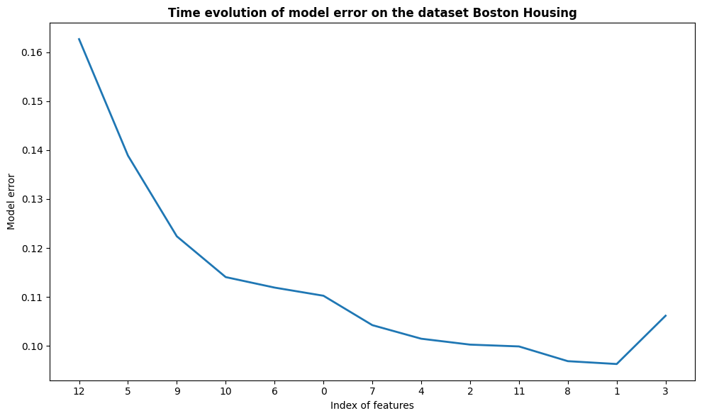

# Adaptive, Hybrid Feature Selection

Python implementation of the Adaptive, Hybrid Feature Selection algorithm (AHFS), originally developed by [Viharos et al.](https://doi.org/10.1016/j.patcog.2021.107932)
For scientific or related inquiries, please contact [Dr. Zsolt János Viharos](https://sztaki.hun-ren.hu/en/organisation/departments/emi/zsolt-janos-viharos) and [Anh Tuan Hoang](https://sztaki.hun-ren.hu/en/organisation/departments/emi/anh-tuan-hoang).

## Getting started

### Basics

The AHFS solution deals with the problem of integrating the most suitable feature selection methods for a given problem in order to achieve the best feature order. A new, adaptive and hybrid feature selection approach was realised, which combines and utilizes multiple individual methods in order to achieve a more generalized solution, called Adaptive Hybrid Feature Selection (AHFS):

**A** - Adaptivity of the proposed algorithm is realized in such a way that at an individual step of the feature selection algorithm it iterates not only in the space of the variables but in the space of available features selection techniques, too. This is the core idea of the solution.

**H** - Hybrid solution is realised which combines the given, available (supervised) feature selection techniques that have their own specific, but fixed feature evaluation measures/metrics.

**F** - Feature

**S** - Selection

The published code contains the Python implementation of the algorithm described in the linked publication. The code exploits the parallel computing capabilities of the running machine, however, still it is relatively time consuming (see the paper about these measurements).

In the paper, various state-of-the-art feature selection methods are presented in detail with examples of their applications. An exhaustive evaluation was conducted to measure and compare their performance with the proposed AHFS approach. Results prove that while the individual feature selection methods may perform with high variety on the test cases, the combined AHFS algorithm steadily provides noticeably better solution.

Enjoy using the AHFS solution.

### Requirements
- Windows or Linux-based platform
- Python version 3.11 or better
- *Optional:* CUDA 11.8 or better

### Installation

Install from PyPI via ```pip install ahfs```. It is recommended that you create a separate environment.

### Usage

You may run one of the preset configurations or run an instance with your own dataset and settings. Example from ```utils.example```:

```
import pandas as pd
from ahfs_class.ahfs import AHFS

data = pd.read_csv(path).values
target = pd.read_csv(target).values

ahfs = AHFS(size)
sel, loss, acc, perit = ahfs.transform(data, target)
```

#### Presets

To run a preset configuration, first download the ```datasets``` folder from this repository into your working directory.
Secondly, import the desired configuration from ```utils.presets``` or use the example code found in ```utils.example```.
Run the configuration by invoking the ```run()``` method on the class instance.

Consult the [API documentation](https://ahfs.readthedocs.io/en/latest/) for further details.

#### Running your own instance

Consult the [API documentation](https://ahfs.readthedocs.io/en/latest/) for further details.

### Running the algorithm on a demo dataset

The chosen demo dataset is Boston Housing, which consists of 13 features. The time evolution of the model error can be plotted by running the second section. The result can be seen in the figure below.



## FAQ

1. I get the warning message ***CUDA is not available! Using CPU..***
   - Re-install the torch package by following [these instructions](https://pytorch.org/get-started/locally/).
